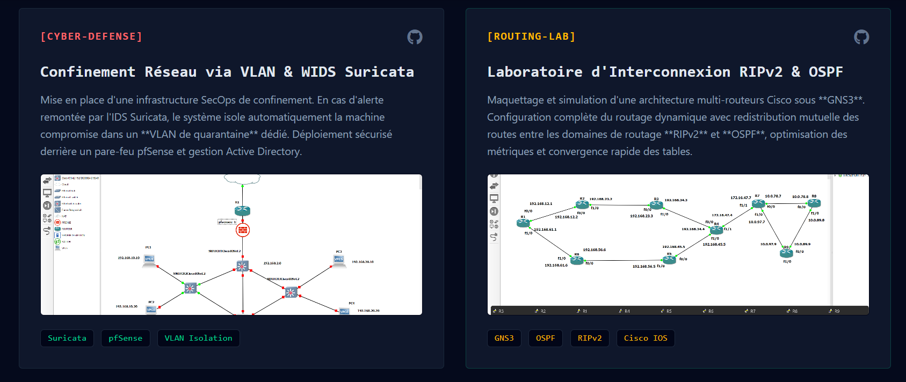
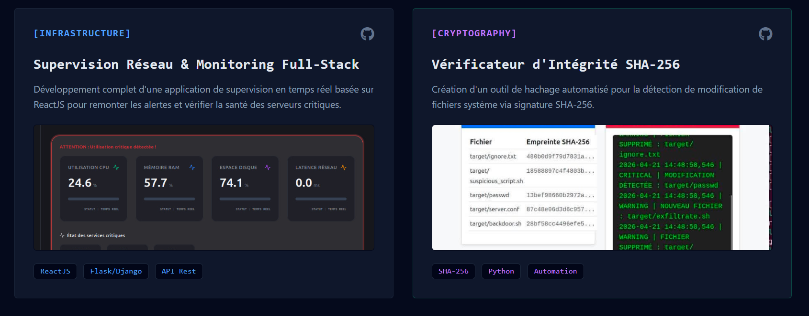

# portfolio
portfolio
# 🛡️ PortFolio SecOps & Infrastructure Réseau

Bienvenue sur le dépôt de mon portfolio professionnel orienté **Administration Systèmes, Réseaux & Cybersécurité**. Ce projet présente mes compétences, mon parcours académique à l'École Nationale d'Informatique (ENI) ainsi que mes laboratoires d'architecture réseau d'entreprise.

## 🚀 Fonctionnalités du Portfolio
*   **Design Responsive & Tech :** Conçu avec Tailwind CSS en mode "dark-theme" pour une esthétique moderne orientée console/cyber.
*   **Animations Fluides :** Intégration d'un script JavaScript personnalisé pour la révélation des éléments au défilement (`reveal-on-scroll`) et une barre de navigation dynamique.
*   **Vitrine de Laboratoires :** Mise en avant de projets concrets de routage, de commutation et de cyberdéfense avec intégration de captures de topologies.

## 🛠️ Stack Technique & Outils Modélisés
*   **Réseaux :** Routage dynamique (OSPF, RIPv2), segmentation VLAN, protocoles NAC, simulateur GNS3, architectures Cisco IOS.
*   **Sécurité :** IDS/WIDS Suricata, pare-feu pfSense, isolation réseau en environnement Active Directory (Windows Server).
*   **Développement & Supervision :** HTML5, Tailwind CSS, JavaScript (ES6), ReactJS, Flask/Django.

## 📸 Aperçu des Laboratoires Inclus
1.  **Solution de Confinement CENI :** Architecture combinant un IDS Suricata et des règles de pare-feu pour isoler dynamiquement les postes infectés dans des VLANs de quarantaine.
2.  **Lab de Routage Dynamique :** Simulation sous GNS3 d'une infrastructure d'entreprise avec redistribution mutuelle de routes entre domaines RIPv2 et OSPF.
3.  **Dashboard de Supervision :** Application full-stack permettant le monitoring de la santé de serveurs Linux (Debian/Ubuntu) et la remontée d'alertes en temps réel.

